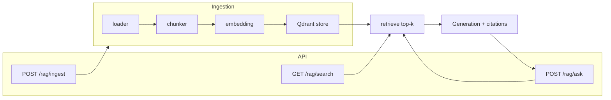

# LLM-Gate

AI-шлюз для инженерных задач: классификация/извлечение по промптам и RAG по внутренней базе знаний (RFC, runbooks, ADR). Ответы только из контекста, с цитатами и статусом `insufficient_context`, если в базе нет ответа.

## Стек

- Python 3.10+
- FastAPI, Pydantic, Jinja2, OpenAI API
- RAG: Qdrant, sentence-transformers (только в образе MCP)
- Инфраструктура: Docker Compose (Postgres 16, Qdrant)
- Сборка: hatchling

## Инфраструктура (v3)

Postgres и Qdrant поднимаются через Docker Compose:

```powershell
docker compose up -d
```

Это запускает:

- **Postgres 16** — порт 5432, БД `llm_gate`, схема `llm`
- **Qdrant** — порт 6333 (REST), 6334 (gRPC), коллекция `kb_chunks_v1`

При первом запуске (чистый volume) init-скрипты из `data/init_db/` автоматически создают роли, таблицы и начальные данные. При повторном запуске (volume уже есть) init пропускается.

### Postgres: схема `llm`

| Таблица | Назначение |
|---|---|
| `kb_documents` | Реестр документов базы знаний (doc_key, title, doc_type, project, sha256) |
| `kb_chunks` | Чанки документов (текст, section, embedding_ref) |
| `runs` | Запуски обработки запросов (телеметрия, токены, стоимость) |
| `run_retrievals` | Аудит retrieval: какие чанки использованы в запросе |
| `tool_calls` | Аудит tool-calls MCP (args, duration_ms, status) |
| `sql_allowlist` | Allowlist таблиц для инструмента `sql_read` |

Пользователи:

| Роль | Права | Пароль (dev) |
|---|---|---|
| `llm_gate_admin` | owner схемы `llm` | `CHANGE_ME_admin_password` |
| `llm_gate_service` | CRUD на все таблицы | `CHANGE_ME_service_password` |
| `llm_gate_readonly` | только SELECT | `CHANGE_ME_readonly_password` |

### Qdrant: коллекция `kb_chunks_v1`

- Размерность: 384 (модель `intfloat/multilingual-e5-small`)
- Метрика: Cosine
- Payload: `doc_id`, `doc_key`, `title`, `doc_type`, `project`, `language`, `chunk_id`, `chunk_index`, `section`, `text`

### Пересоздание с нуля

Если нужно сбросить данные и переинициализировать:

```powershell
docker compose down -v
docker compose up -d
```

Коллекция Qdrant создаётся отдельно (не через init-скрипты Postgres) — при пересоздании нужно создать её вручную или через ingestion pipeline.

## Установка

**Только оркестратор** (локально, без RAG-зависимостей; `/rag/ingest` и `/rag/search` вызывают MCP):

```powershell
pip install -e ".[dev]"
```

**Полный стек** (оркестратор + тесты с индексацией и golden set, локальный RAG):

```powershell
pip install -e ".[dev,mcp]"
```

Два приложения собираются и запускаются независимо: оркестратор не тянет sentence-transformers/qdrant; MCP-сервер — отдельный образ с `.[mcp]`.

## Запуск

Из корня репозитория (после `pip install -e .`):

```powershell
uvicorn app.main:app --reload
```

Либо с явным путём к приложению:

```powershell
$env:PYTHONPATH = "src"
uvicorn app.main:app --reload --app-dir src
```

- API: http://127.0.0.1:8000
- Документация: http://127.0.0.1:8000/docs

### Сборка Docker (два образа)

**Оркестратор** (лёгкий образ, без PyTorch/sentence-transformers):

```powershell
docker build -t llm-gate-orchestrator -f Dockerfile.orchestrator .
```

**MCP-сервер** (образ с RAG-зависимостями):

```powershell
docker build -t llm-gate-mcp-deps -f Dockerfile.mcp.deps .
docker build -t llm-gate-mcp -f Dockerfile.mcp .
```

Оркестратор для `/rag/ingest` и `/rag/search` обращается к MCP по `MCP_SERVER_URL`; контейнеры можно поднимать и масштабировать независимо.

## Эндпоинты

### Промпты (классификация / извлечение)


- `GET /prompts` — список промптов и версий
- `POST /run/{prompt_name}` — выполнить промпт (body: `version`, `task`, `input`, `constraints`)

Пример:

```powershell
curl -X POST http://127.0.0.1:8000/run/classify -H "Content-Type: application/json" -d '{\"version\": \"v1\", \"task\": \"Classify\", \"input\": \"После релиза 2.1.3 на странице оплаты 500 ошибка.\"}'
```

### RAG (база знаний)



- `POST /rag/ingest` — индексация документов из `data/` (все `*.json` с массивом `documents`) в Qdrant (ответ: `docs_indexed`, `chunks_indexed`, `duration_ms`)
- `GET /rag/search?q=...&k=5` — поиск чанков по запросу
- `POST /rag/ask` — ответ по контракту с цитатами (body: `question`, `k`, `filters?`, `strict_mode`)

Перед поиском и ответами нужно один раз вызвать `POST /rag/ingest`. В `data/` могут лежать несколько файлов (например `knowledge_base.json`, `knowledge_base_rus.json`) — все подхватываются при индексации.

## Конфигурация

Переменные окружения (или `.env`):

| Переменная | Описание | Значение по умолчанию |
|---|---|---|
| `LLM_BASE_URL` | URL LLM API | — |
| `LLM_MODEL` | Модель LLM | — |
| `LLM_MAX_TOKENS` | Лимит токенов ответа | 1024 |
| `LLM_TIMEOUT` | Таймаут LLM (секунды) | 60 |
| `LLM_MAX_RETRIES` | Повторы при ошибках LLM | 2 |
| `ENABLE_TOKEN_METER` | Логирование расхода токенов | false |
| `RAG_EMBEDDING_MODEL` | Модель эмбеддингов | `intfloat/multilingual-e5-small` |
| `RAG_CHUNK_SIZE` | Размер чанка (символы) | 512 |
| `RAG_CHUNK_OVERLAP` | Перекрытие чанков | 64 |
| `RAG_DEFAULT_K` | Top-k по умолчанию | 5 |
| `RAG_RELEVANCE_THRESHOLD` | Порог релевантности | 0.3 |
| `DATABASE_URL` | Postgres connection string | — |
| `QDRANT_URL` | Qdrant REST endpoint | `http://localhost:6333` |
| `QDRANT_COLLECTION` | Имя коллекции Qdrant | `kb_chunks_v1` |
| `MCP_SERVER_URL` | URL MCP-сервера | `http://localhost:8001/mcp` |

## Тесты

```powershell
pytest
```

Из корня репозитория; `pythonpath` и `testpaths` заданы в `pyproject.toml`. Golden set в одном тесте: один ingest из `data/`, затем проверки по английскому (`questions.json`) и русскому (`questions_rus.json`) наборам (15+5 вопросов каждый). Медленные тесты (ingest + retrieval) можно отключить: `pytest -m "not slow"`. Для них нужна установка с `.[dev,mcp]`.
